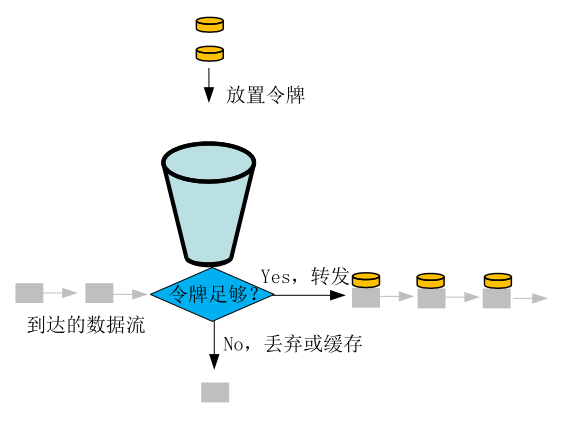

如上图[5] 所示，令牌桶的大概原理是：

- 我们以 r/s  的速度向桶内放置令牌，桶的容量为 b , 如果桶满了令牌将会丢弃
- 当请求到达时，我们向桶内获取令牌，如果令牌足够，我们就通过转发请求
- 如果桶内的令牌数量不够，那么这个请求会被缓存等待令牌足够时转发，或者是被直接丢弃掉

<b>由于桶的存在，所以令牌桶算法不仅可以限流还可以应对突发流量的情况</b>
举个例子：假设我们桶的容量是 100，速度是 10 rps，那么在我们桶满的情况下，如果突然来 100 个请求是可以满足的，但是后续的请求就会被限制到 10 rps

存在下面两种特殊情况

- 如果桶的容量为 0，那么相当于禁止请求，因为所有的令牌都被丢弃了
- 如果令牌放置速率为无穷大，那么相当于没有限制

令牌桶最常见的实现就是 Go 官方的 golang.org/x/time/rate, 我们这里是基于此的封装

# Reference 

- [Go 进阶训练营-极客时间](https://u.geekbang.org/subject/go?utm_source=lailin.xyz&utm_medium=lailin.xyz)
- Token bucket - Wikipedia
- [令牌桶算法_百度百科 (baidu.com)](https://baike.baidu.com/item/%E4%BB%A4%E7%89%8C%E6%A1%B6%E7%AE%97%E6%B3%95)
- [限流的概念，算法，分布式限流以及微服务架构下限流的难点 - 知乎 (zhihu.com)](https://zhuanlan.zhihu.com/p/158948815)
- [令牌桶工作原理 - 知乎 (zhihu.com)](https://zhuanlan.zhihu.com/p/164503398)
- golang.org/x/time/rate
